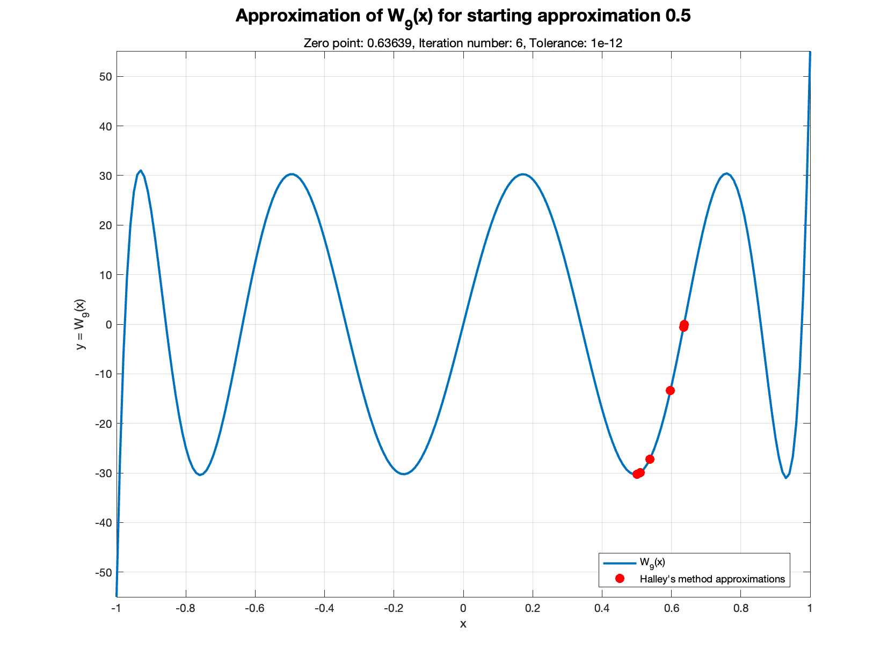
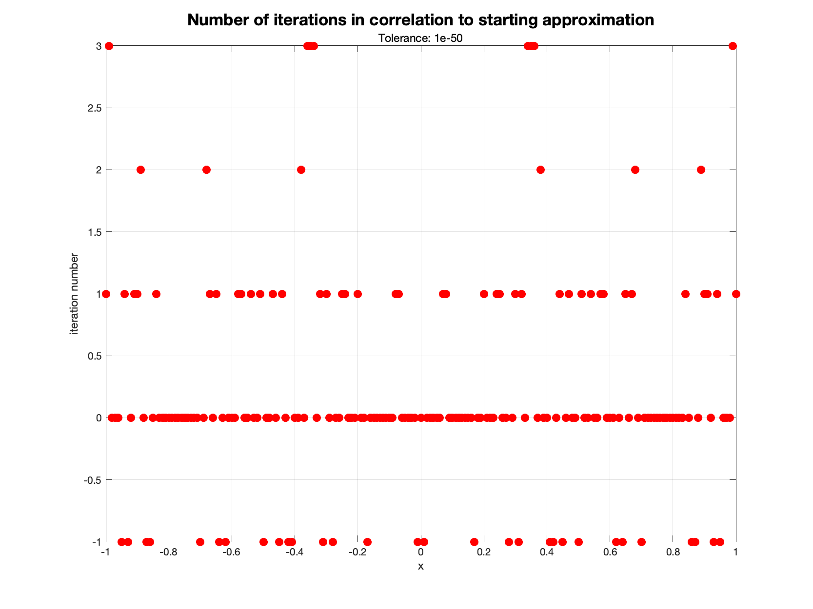
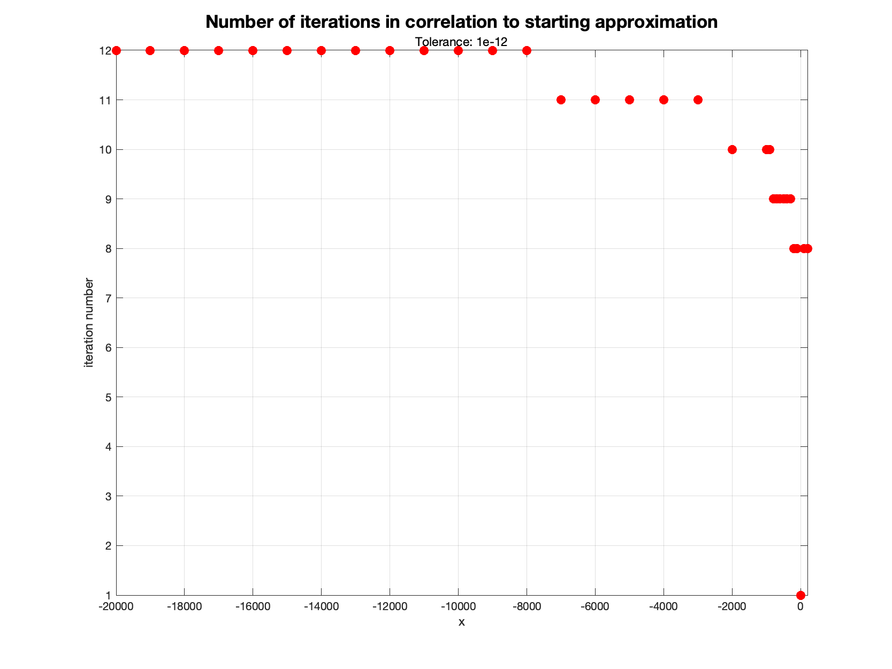

---
export_on_save:
    puppeteer: ["pdf"]
---

# <p style="text-align: center;">Project 1</p>

<p style="text-align: center;"> Numerical methods, Faculty of Mathematics and Information Science, Warsaw University of Technology </p>
<p style="text-align: center;"><i>Paweł Pozorski</i><br/><i>26.11.2023</i></p>

### Finding zero points of polynomial \(w_n(x)\) using Halley's method

Given the polynomial

\[w_n(x) = \sum_{k=0}^{n} a_k T_k(x) T_{n-k}(x)\]

where \(x \in \mathbb{R} \), \(T_0, T_1, \ldots, T_n\) - 1'st type Chebyshev polynomials (\(T_k(x) = \cos(k \arccos(x))\), defined for \(x \in [-1, 1]\) and  \(n = 0, 1, \ldots\)), \(a_k \in \mathbb{R}\), \(n \in \mathbb{N} \) - known constants, 
we'll be looking for zero points of \(w_n(x) \) using Hallye's method.

## 1. Definition of Hallye's method

Let \(f: \mathbb{R} \to \mathbb{R}\) - function of class \(C^2(\mathbb{R})\) (so it has continous second derevative), and \(x_0 \in \mathbb{R}\) - given starting approximation for \(f\) zero point. Using Taylor series of function \(f\) for the area of point \(x_k\) (where \(x_k \in \mathbb{R}\) and \(k \in \mathbb{N}\)) we get \(p\) - the approximation of function \(f\):

\[ p(x) = f(x_k) + f'(x_k)(x - x_k) + \frac{1}{2} f''(x_k)(x - x_k)^2 \]

Assuming \(f(x_{k + 1}) = 0 \) we get

\[ f(x_k) + f'(x_k)(x_{k+1} - x_k) + \frac{1}{2} f''(x_k)(x_{k+1} - x_k)^2 = 0 \]

Therefore 

\[ x_{k+1} = x_k - \frac{f(x_k)}{f'(x_k) + \frac{1}{2}f''(x_k)(x_{k + 1} - x_k)} \]

Furthermore, values on the right side of this equasion we can approximate with the Newton's method (so \(x = x - \frac{f(x_k)}{f'(x_k)}\)). This gives us the final formula:

\[ x_{k+1} = x_k - \frac{2f(x_k)f'(x_k)}{2(f'(x_k))^2 - f(x_k)f''(x_k)} \]

By creating a sequence \((x_0, x_1, x_2, x_3, \ldots)\) of real points fulfilling upper formula we might be able to create a sequence that is convergent to zero point of \(f\).
So the Halley's method for next approximation takes a point \(x_k \in \mathbb{R}\) which is a zero point of a hyperbole that approximates \(f\) at point \(x_k \).

## 2. Computation Limitation

For obvious reasons computers are unable to calculate this limit, therefore some convergence criteria must be introduced. In this work's implementation we're using below condition to stop computation:

\[\lvert x_{k+1} - x_k \rvert < \epsilon \land \lvert f(x_{k + 1}) \rvert < \epsilon \]

for some \(\epsilon > 0\). Therefore, this \(\epsilon\) is maximum error we can get from this computation, which leaves nearly no space for analysing this method errors. 

## 3. Implementation details

Alonside some utility functions to create below plots, implementation in Matlab consists of the following functions:
```Matlab
function root = halley(F, x0, tolerance, max_iterations)
    % Halley's method for finding a root of the function F
    % it will be the last element of root return variable
    % earlier entries are how x values in (i-1)th iteration
    
    % F: function of one parameter x that returns [F(x), F'(x), F''(x)]
    % x0: starting approximation
    % tolerance: convergence tolerance
    % max_iterations: maximum number of iterations

function [Wx, Wdx, Wddx] = W(a, n, x)
    % calculates value of a function W given in task at points x, 
    % its first and second derevative
  
    % a: vector coefficients of the chebyshev polynomial (a_0, a_1, ..., a_n)
    % n: degree of the chebyshev polynomial
    % x: vector of points where the function should be evaluated

function W_func = create_W_func(a)
    % Creates W_n function according to halley function requirements,
    % so the function of just one parameter x that returns W_n(x), W'_n(x), W''_n(x)
```

<code>halley</code> is responsible for conducting the Halley algorithm until it coverages or exceedes maximum allowed interation count. <code>W</code> is our \(w_n(x)\) polynomial implementation. For performance reasons, <code>W</code> returns all \(w_n(x), w_n'(x), w_n''(x)\) at one and calculates the Chebyshev polynomials using dynamic programming and recursive relationship fulfilled by Chebyshev polynomials which goes as follows:

- \(T_0(x) = 1\)
- \(T_1(x) = x\)
- \(T_k(x) = 2xT_{k-1}(x) - T_{k-2}(x)\) for \(k = 2, 3, \ldots\).

<code>W_func</code> allows easier calls on <code>W</code> with already set sequence \( a = (a_0, a_1, a_2, a_3, \ldots, a_n)\) and \(n \in \mathbb{N}\). Let us see example execution call:

```matlab
% example 1

% define an a sequence
a = 1:10;
fprintf("\na=[" + num2str(a) + "]\n");

% Create W_n of one parameter x
W_func = create_W_func(a);

% plot W_n on range <-1, 1>, and sequence x = (x_1, ...) of next
% approximations of Haley's method for starting approximation of 0.5
% tolerance 10^-12 and maximum iteration number 10^3
plotHalley(W_func, a, 0.5, -1, 1, 0.01, 10^-12, 10^3, "example1.png");

% retrieve x sequence for the same function parameters
z = halley(W_func, 0.5, 10^-12, 10^3);
% print final zero point
fprintf("Final score: %.20f \n", z(length(z)));

% calculate error
expected = 0.636393495191836;
error = calculate_error(expected, z(length(z)));
fprintf("Relative error: " + error + "\n");

% test if method in fact approched it with correct tolerance
assert(abs(error) < 10^-12);
```

Which outputs:
```bash
a=[1   2   3   4   5   6   7   8   9  10]
Final score: 0.63639349519183574522 
Relative error: -3.4891e-16
```

## 4. Computation examples and analysis
Lets begin with some visual examples:

<p align="center">
  
  <em><i>Example 1.</i> Here we begin a little bit to right from the middle of the curve. Algorithm decides to approach towards right and manages to coverage in 7 iterations.<br/>
  a='1   2   3   4   5   6   7   8   9  10'</em>
</p>
<p align="center">
  
  <em><i>Example 2.</i> Here we begin a little bit to left from the center. Note that for center this method will not converage, it'll get stuck there.<br/>a='-0.45055      1.9936      2.8743      2.5057     0.94723'</em>
</p>
<p align="center">
  
  <em><i>Example 3.</i> Here we begin at 0.05, and algorithm scans both to right and the left before reahing coverage at around -1 (interestingly it's further away than coverage point around 0.95).<br/>a='-0.45055      1.9936      2.8743      2.5057     0.94723'</em>
</p>

Let's now try to analyze how many iterations this method require for such an easy example as the last upper one.

<p align="center">
  
  <em>Number of iterations equals to -1 represents that for given maximum iterations (10^3) Hallye's method didn't manage to find the zero point</em> 
</p>

From above image we can easily tell, which of course checks with the math, that when function derevative is 0 Halley's algorithm gets trapped forever, therefore it exceedes any possible iteration limit and we cannot use it to approximate the zero points. For clarity let's look at this again:

<p align="center">
  
  <em>Function we'll try to approximate with Halley's method. It has many points where its derevative is equal to 0 and many points where its value is close to 0.</em> 
</p>


<p align="center">
  
  <em>As we've expected, Halley's method either finds optimal solution in couple of iterations or gets stuck.</em> 
</p>

The only remaining question is how fast can it approach (if it is possible) the desired optimum while being relatively far away from it. To anwser this question let's look at next 2 charts that tackle this problem using very simple function:

<p align="center">
  
  <em>Function graphical representation for small x. As we can see, it raises pretty quickly yet it's extreamly simple and smoth.</em> 
</p>


<p align="center">
  
  <em>We can se that the higher the function value is - thus in our case the further we are from zero point - the longer it takes to reach it. Note however, that the iterations gain is slow, loking alike logarithmic / square root function.</em> 
</p>

## 5. Accuracy analysis

Let's now spend a little more time and look what are the accual errors for zero points found for first three examples. We have

| Example num | Wolfram zero point | Halley's zerro point (tol=10^-12) | error       |
| ----------- | ------------------ | --------------------------------- | ----------- |
| 1           | 0.636393495191836  | 0.63639349519183574522            | -3.4891e-16 |
| 2           | -0.372210564161923 | -0.37221056416192388472           | 2.3862e-15  |
| 3           | 0.981548363136206  | 0.98154836313620497101            | -1.018e-15  |

Although relatively small Wolfram accuracy all of the errors are lower than set tolerance of \(10^{-12}\).
