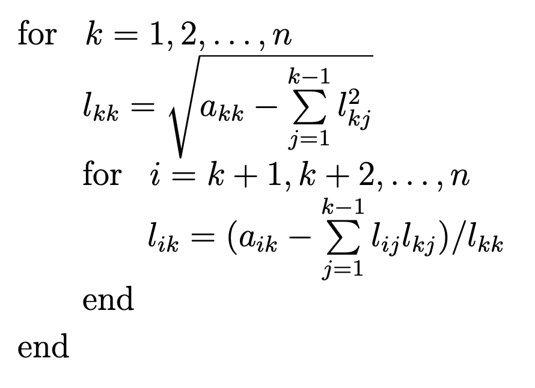
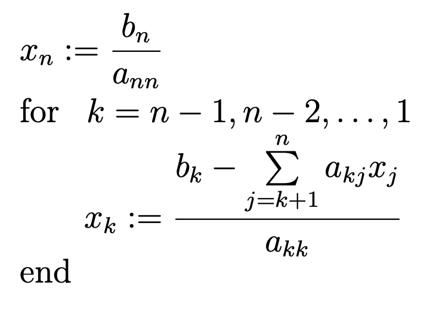
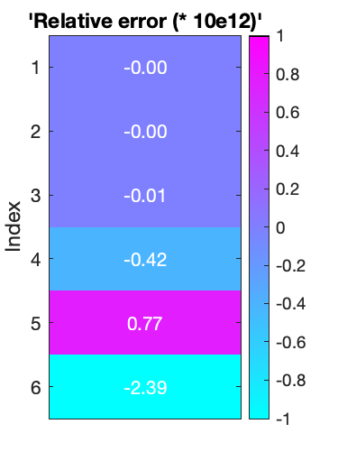
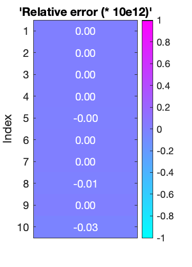
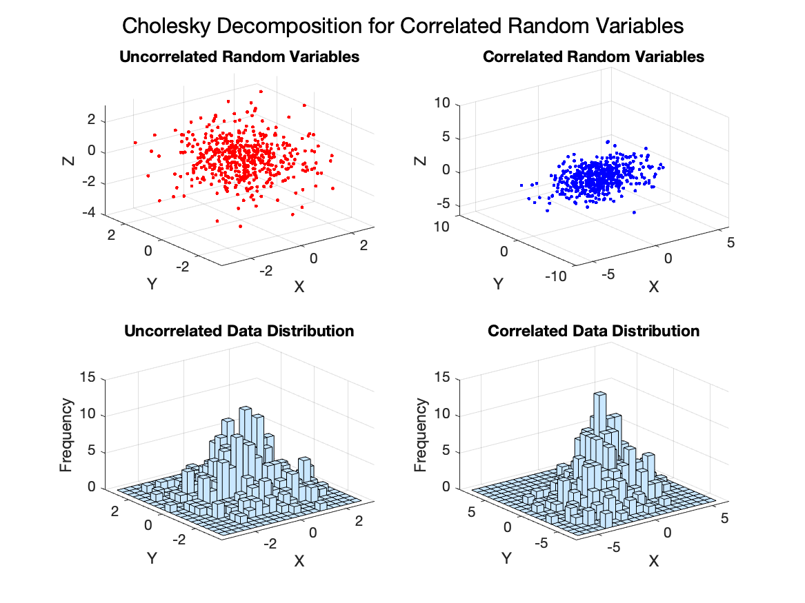
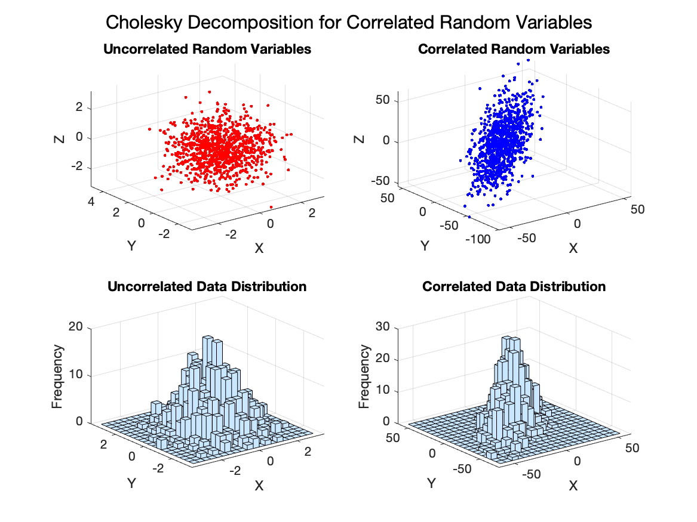

---
export_on_save:
    puppeteer: ["pdf"]

puppeteer:
  format: "A4"
  margin: 
    top: "2cm"
    bottom: "2cm"
    right: "1.5cm"
    left: "1.5cm"
  scale: 0.9
---

# <p style="text-align: center;">Project 2</p>

<p style="text-align: center;"> Numerical methods, Faculty of Mathematics and Information Science, Warsaw University of Technology </p>
<p style="text-align: center;"><i>Paweł Pozorski gr 4</i><br/><i>20.12.2023</i></p>

### Problem overview

Given the matrix

\[ A = \begin{bmatrix} A_{1,1} & A_{1,2} \\ A_{1,2}^T & -A_{2,2} \end{bmatrix} \]

where \(A \in \mathbb{R}^{n \times n} \), \(A_{i, j} \in \mathbb{R}^{p \times p} \), \(n = 2*p\) and \( n \in \mathbb{N} \) with assumptions that \(A_{1, 1} \) and \(A_{2, 2} \) are symmetric (i.e. \( A_{i, i} = A_{i, i}^T \) for \(i \in \set {1, 2})\) and positive definite (i.e. \( \forall_{R \; \in \; \mathbb{C}^n, \; x \; \neq \; \mathbf{0} } \; x^T A x > 0\) )

We look for the block decomposition 

\[ A = L D L^T \] 

and for the solution of linear equations system given by

\[ A x = b \] 

where \( L = \begin{bmatrix} L_{1,1} & \mathbf{0} \\ L_{2,1} & L_{2,2} \end{bmatrix} \), \( D = \begin{bmatrix} \mathbf{I} & \mathbf{0} \\\mathbf{0} & -\mathbf{I} \end{bmatrix} \) and matrixes \( L_{1, 1}, L_{2, 2} \in \mathbb{R}^{n \times n} \) are bottom triangular matrixes, \( x, b \in \mathbb{R}^n \).

## 1. Definition of  Cholesky-Banachiewicz decomposition (\(LL^T\))

If \(A \in \mathbb{R}^{n \times n}\) is a symmetric positive definite matrix, then there exists a unique lower triangular matrix \(L\) with positive elements on its main diagonal such that \(A = LL^T\), where again \(L \in \mathbb{R}^{n \times n}\).

To find such decomposition, we need to solve equation \( A = L L^T \) which goes as folows: 

\[
\begin{bmatrix} a_{11} & a_{12} & \dots & a_{1n} \\ a_{12} & a_{22} & \dots & a_{2n} \\ \vdots & \vdots & \ddots & \vdots \\ a_{1n} & a_{2n} & \dots & a_{nn} \end{bmatrix} = \begin{bmatrix} l_{11} & 0 & \dots & 0 \\ l_{21} & l_{22} & \dots & 0 \\ \vdots & \vdots & \ddots & \vdots \\ l_{n1} & l_{n2} & \dots & l_{nn} \end{bmatrix} \begin{bmatrix} l_{11} & l_{21} & \dots & l_{n1} \\ 0 & l_{22} & \dots & l_{n2} \\ \vdots & \vdots & \ddots & \vdots \\ 0 & 0 & \dots & l_{nn} \end{bmatrix}
\]

Let's try to understand how the Cholesky-Banachiewicz decomposition algorihm works for small \(A \in \mathbb{R}^{3 \times 3}\). We need to solve 

\[ \begin{bmatrix} a_{11} & a_{12} & a_{13} \\ a_{21} & a_{22} & a_{23} \\ a_{31} & a_{32} & a_{33} \end{bmatrix} = \begin{bmatrix} l_{11} & 0 & 0 \\ l_{21} & l_{22} & 0 \\ l_{31} & l_{32} & l_{33} \end{bmatrix} \begin{bmatrix} l_{11} & l_{21} & l_{31} \\ 0 & l_{22} & l_{32} \\0 & 0 & l_{33} \end{bmatrix} \]


After performing \( L L^T \) multiplication from right side of this equation we get

\[ \begin{bmatrix} a_{11} & a_{12} & a_{13} \\ a_{21} & a_{22} & a_{23} \\ a_{31} & a_{32} & a_{33} \end{bmatrix} = \begin{bmatrix} l_{11}^2 & l_{11}l_{21} & l_{11}l_{31} \\ l_{11}l_{21} & l_{21}^2 + l_{22}^2 &  l_{21}l_{31} + l_{22}l_{32} \\ l_{11}l_{31} & l_{21}l_{31} + l_{22}l_{32} & l_{31}^2 + l_{32}^2 + l_{33}^2 \end{bmatrix} \]

From this form we can calculate neccessary coefficient in the following order: \( l_{11} \), \( l_{21} \), \( l_{31} \), \( l_{22} \), \( l_{32} \) and \( l_{33} \). This leads us to the following iterational algorithm:

<p align="center">
  
  <em><i>Cholesky-Banachiewicz Decomposition Algorith</i></em>
</p>

## 2. Solving easy linear equations system

We'll propose an easy algorithm for solving linear equations given by the following:

\[ A x = b \] 

where \(A \in \mathbb{R}^{n \times n} \) is an upper triangular, it has no zeros on its main diagonal and \( x, b \in \mathbb{R}^n \). We can write it in the extended form:

\[ \begin{bmatrix} a_{11} & a_{12} & \dots & a_{1, n-2} & a_{1,n-1} & a_{1n} \\ 0  & a_{22} & \dots & a_{2, n-2} & a_{2,n-1} & a_{2n} \\ \vdots & \vdots & \ddots & \vdots & \vdots & \vdots \\ 0 & 0 & \dots & 0 & a_{n-1, n-1} & a_{n-1, n} \\ 0 & 0 & \dots & 0 & 0 & a_{nn} \end{bmatrix} \begin{bmatrix} x_{1} \\ x_{2} \\ \vdots \\ x_{n} \end{bmatrix} = \begin{bmatrix} b_{1} \\ b_{2} \\ \vdots \\ b_{n} \end{bmatrix} \]

From this form it is easily seen that we can first calculate \( x_n = b_n / a_{nn} \), than \( x_{n-1} = (b_{n-1} - x_n * a_{n-1, n}) / a_{n-1, n-1} \) etc.

Let's now propose an iterational algorithm solving equation of given form:

<p align="center">
  
  <em><i>Solving system of linear equations Ax = b, where A is positive defined, upper triangular matrix.</i></em>
</p>

## 3. Problem solution

We want to find the \( L \) and \( D \) matrixes which meet 

\[ A = L D L^T \] 

\[ \begin{bmatrix} A_{1,1} & A_{1,2} \\ A_{1,2}^T & -A_{2,2} \end{bmatrix} = \begin{bmatrix} L_{1,1} & \mathbf{0} \\ L_{2,1} & L_{2,2} \end{bmatrix} \begin{bmatrix} \mathbf{I} & \mathbf{0} \\\mathbf{0} & -\mathbf{I} \end{bmatrix} \begin{bmatrix} L_{1,1}^T & L_{2,1}^T \\ \mathbf{0} & L_{2,2}^T \end{bmatrix} \]

\[ \begin{bmatrix} A_{1,1} & A_{1,2} \\ A_{1,2}^T & -A_{2,2} \end{bmatrix} = \begin{bmatrix} L_{1,1} L_{1,1}^T & L_{1,1} L_{2,1}^T \\ L_{2,1} L_{1,1}^T & L_{2,1} L_{2,1}^T - L_{2,2} L_{2,2}^T \end{bmatrix} \]

\[ \begin{bmatrix} A_{1,1} & A_{1,2} \\ A_{1,2}^T & -A_{2,2} \end{bmatrix} = \begin{bmatrix} L_{1,1} L_{1,1}^T & L_{1,1} L_{2,1}^T \\ (L_{1,1} L_{2,1}^T ) ^T & L_{2,1} L_{2,1}^T - L_{2,2} L_{2,2}^T \end{bmatrix} \]

Therefore, our tasks breaks into finding the \( L L^T \) decomposition for \( A_{1, 1} \) matrix - \( L_{1, 1}\) -  which under our assumptions is possible ([refer here](#1-definition-of-cholesky-banachiewicz-decomposition-llt)), and then to solve 

\[ A_{1, 2} = L_{1, 1}L_{2, 1}^T \]

But under our assumptions \( L_{1, 1} \) is a lower triangular matrix with positive elements on its main diagonal, so \( det(L_{1, 1}) \neq 0 \), so \( \exists \; L_{1, 1}^{-1} \). Therefore we have

\[ L_{1, 1}^{-1} A_{1, 2} =  L_{1, 1}^{-1} L_{1, 1}L_{2, 1}^T \]

\[ L_{2, 1}^T =  L_{1, 1}^{-1} A_{1, 2} \]

\[ L_{2, 1} =  A_{1, 2}^T (L_{1, 1}^{-1})^T \]

Thanks to our assumptions about \( L_{1, 1} \) it can be easily invertable. Now we need to solve 

\[ -A_{2,2} = L_{2,1} L_{2,1}^T - L_{2,2} L_{2,2}^T \]

\[ L_{2,2} L_{2,2}^T = L_{2,1} L_{2,1}^T + A_{2,2} \]

So we need to find the \( L L^T \) decomposition for \( L_{2,1} L_{2,1}^T + A_{2,2} \), which under our assumptions is possible - first of all,  \(  L_{2,1} L_{2,1}^T \) is symmetric, because we have \( L_{2,1}^T = L_{1, 1}^{-1} A_{1, 2}\), so

\[ L_{2,1} L_{2,1}^T = (L_{1, 1}^{-1}A_{1, 2})^T L_{1, 1}^{-1} A_{1, 2} = A_{1, 2}^T (L_{1, 1}^{-1})^T L_{1, 1}^{-1} A_{1, 2} = A_{1, 2}^T (L_{1, 1}^{-1})^T ((L_{1, 1}^{-1})^T)^T A_{1, 2} = A_{1, 2}^T ((L_{1, 1}^{-1})^T L_{1, 1}^{-1}) ^T A_{1, 2} =  A_{1, 2}^T ((L_{1, 1} L_{1, 1}^T )^{-1}) ^T A_{1, 2} = A_{1, 2}^T (A_{1, 1}^{-1}) ^T A_{1, 2} \]

therefore 

\[ (L_{2,1} L_{2,1}^T)^T = (A_{1, 2}^T (A_{1, 1}^{-1}) ^T A_{1, 2})^T = A_{1, 2}^T (A_{1, 1}^{-1}) A_{1, 2} = A_{1, 2}^T (A_{1, 1}^{-1}) ^T A_{1, 2} = L_{2,1} L_{2,1}^T \]

because \(A_{1, 1}\) is positive definite, symmetric matrix so \( \exists \; A_{1, 1}^{-1} \) and \( (A_{1, 1}^{-1})^T = A_{1, 1}^{-1} \). Moreover, as we know that \( A_{2, 2} \) is symteric positive definited, we only need to show that 

\[ \forall_{x \in \mathbb{R}^n, \; x \neq \mathbf{0}} \; x^T ( L_{2,1} L_{2,1}^T ) x >= 0 \]

But \( x^T (A_{1, 2}^T (A_{1, 1}^{-1}) ^T A_{1, 2}) x = (A_{1, 2} \; x) ^T (A_{1, 1}^{-1}) ^T (A_{1, 2} \; x ) \), so from positive definiteness of \( A_{1, 1} \) we proof out satement.

This gave us desired patterns on how to calculate our \( L \) matrix. Now let's try to solve our initial equation using this decomposition:

\[ A x = b \] 

\[ (L D L^T) x = b \] 

\[ L^{-1} L (D L^T) x = L^{-1} b \] 

\[ (D L^T) x = L^{-1} b \] 

Please note, that \( L^T = \begin{bmatrix} L_{1,1}^T & L_{2,1}^T \\ \mathbf{0} & -L_{2,2}^T \end{bmatrix}  \) is an upper triangular matrix, therefore last form of our equation can be easily solved using [this method](#2-solving-easy-linear-equations-system) if we devide it into 2 steps:
1. \( L^{-1} b = y \) which is equivalent to \( Ly = b \) and L is an lower triangular matrix (so [this method](#2-solving-easy-linear-equations-system) can be easily converted to work for this as well)
2. \( (D L^T) x = y \) 

Please note that from assumptions about \( L_{1,1} \) and \( L_{2,2} \) we get (Let's further A be matrix meeting this asumptions) 

\[ \forall_{i \in \set {1, \dots, n}} a_{ii} \neq 0\]

because then \( det(A) = a_{11} * a_{22} * \dots * a_{nn} = 0 \) which leads us to contradiction, because from assumption about positive definition of A we got in particular \( det(A) \neq 0 \), which is direct conclusion from the Sylvester's criterion:

*Let \( A \in \mathbb{R}^{n \times n} \) be a symmetric matrix. Matrix \( A \) is positive definite if and only if all its leading principal minors are positive, i.e. 
\[ \forall_{i \in \set {1, \dots, n}} \; det(\begin{bmatrix} a_{11} & \dots & a_{1n} \\  \vdots & \ddots & \vdots \\ a_{1n} & \dots & a_{nn} \end{bmatrix}) > 0 \]*

Therefore both \( L \) and \( D L^T \) meet criteria of [this method](#2-solving-easy-linear-equations-system).

> We could've solve just \( (D L^T) x = L^{-1} b \), but this'd require finding inversion of L - approach shown above is faster than matlab's default ^-1 operator. 

## 4. Implementation details

Alonside some utility functions to create below plots, implementation in Matlab consists of the following functions:
```Matlab
function L = cholesky_decomposition( A, check_params )
    % Performs cholesky decomposition of matrix A 
    % 
    % A: square, simmetrical and positively defined matrix
    % check_params - weather to check if input array A meets its
    %                assumptions, which is computation extensive
    %                defaults to false

function x = solve_equation( A, b, opt, check_params )
    % Solves system of linear equations Ax = b
    % 
    % A: square (nxn), upper triangular and positively defined matrix
    % b: vector of size n
    % opt - "upper" or "lower", defines A
    % check_params - weather to check if input array A meets its
    %                assumptions, which is computation extensive
    %                defaults to false

function [L, D, x] = solve_project( A, b, check )
    % Solves system of linear equations Ax = b where A is matrix 
    % defined in project.
    % 
    % A: block matrix [X, Y; Y^T, Z] (square (nxn)), where X and Z 
    % are symmetrical, positive defined matrixes.
    % b: vector of size n
    % check - weather to check if input data meets its assumtions
    %         and all computations are performed correctly
```

- <code>cholesky_decomposition</code> is responsible for conducting the cholesky decomposition [algorithm](#1-definition-of-cholesky-banachiewicz-decomposition-llt). Let us have a look onto this implementation:

  ```matlab
  L = zeros(n, n);
  for k = 1:n
    to_deduct = 0;
    if k > 1
        to_deduct = sum(L(k, 1:k-1).^2);
    end

    L(k, k) = sqrt(A(k, k) - to_deduct);
    L(k+1:n, k) = (A(k+1:n, k) - L(k+1:n, 1:k-1) * L(k, 1:k-1)') / L(k, k);
  end
  ```

  As we could've expected, everything was easily vectorizable, therefore we can count on high performance on large arrays.

- <code>solve_equation</code> is implementation of linear equation system solving algoritm described [here](#2-solving-easy-linear-equations-system). Let us have a look onto this implementation:

  ```matlab
  x = zeros(n, 1);
  if opt == "upper"
      x(n) = b(n) / A(n, n);
      for k = (n-1):(-1):1
        s = b(k) - A(k, (k+1):n) * x((k+1):n);
        x(k) = s / A(k, k);
      end
  else
      x(1) = b(1) / A(1, 1);
      for k = 2:n
        s = b(k) - A(k, 1:(k-1)) * x(1:(k-1));
        x(k) = s / A(k, k);
      end
  end
  ```

  Again, we perform as much vectorization as possible and we've implemented it both for systems defined by lower triangular matrices as well as for upper triangular matrices.

- <code>solve_project</code> is implemented project solution exacly as described [here](#3-problem-solution). Here nothing fancy happens.

This implementation can be further speeded up by implementing custom  ^-1 operator for \( L_{1, 1} \), that will be faster than matlab's thus to our knowledge that \( L_{1, 1} \) is bottom triangular matrix.

Let us now have a look at the example call of these function. Please note that passing true parameter as below does validates both input and output parameters + print major steps errors, which makes execution significantly more expensive, thus it is not recommended to use it in practice.

```matlab
%%%%%%%%%%%%%%%%%%%%%%%%%%%%%%%%%%%%%%%%%%%%%%%%%%%%%%%%%%%%%%%%%%%%%%%%%%%
% example 1

% define A and b
% utility function that creates 6x6, symetric positive-defined matrix
A = generate_matrix(6);
b = rand(6, 1);

% solve project using 
[L, D, x] = solve_project(A, b, true);

fprintf("\nMatrix A:\n");
disp(A);
fprintf("Vector b:\n");
disp(b);
fprintf("Solution vector b:\n");
disp(x);
fprintf("Matrix L:\n");
disp(L);
fprintf("Matrix D:\n");
disp(D);

%%%%%%%%%%%%%%%%%%%%%%%%%%%%%%%%%%%%%%%%%%%%%%%%%%%%%%%%%%%%%%%%%%%%%%%%%%%
```

Which outputs:
```bash
Error in calculating L_11: 0.00000000000000009021 (relative 0.00000000000000002965) 
Error in calculating L_22: 0.00000000000000310862 (relative 0.00000000000000018104) 
Error in solving equation: 0.00000000000006422640 (relative 0.00000000000002200311) 

Matrix A:
    0.4807    0.6056    0.5833    0.1448    0.3401    0.0892
    0.6056    0.9564    0.7942    0.9748    0.6162    0.5215
    0.5833    0.7942    0.7295    0.8338    0.3038    0.8253
    0.1448    0.9748    0.8338   -0.4645   -0.5229   -0.6780
    0.3401    0.6162    0.3038   -0.5229   -1.1206   -1.0906
    0.0892    0.5215    0.8253   -0.6780   -1.0906   -1.3123

Vector b:
    0.7639
    0.9476
    0.3335
    0.3897
    0.1504
    0.3337

Solution vector b:
    0.6548
    0.0189
    0.3029
    0.1859
    0.9167
   -0.8697

Matrix L:
    0.6933         0         0         0         0         0
    0.8735    0.4398         0         0         0         0
    0.8414    0.1349    0.0590         0         0         0
    0.2089    1.8016    7.0370    7.2989         0         0
    0.4905    0.4269   -2.8238   -2.5315    1.7632         0
    0.1287    0.9302   10.0304    9.9967   -0.8318    1.4753

Matrix D:
     1     0     0     0     0     0
     0     1     0     0     0     0
     0     0     1     0     0     0
     0     0     0    -1     0     0
     0     0     0     0    -1     0
     0     0     0     0     0    -1
```

## 5. Computation examples and analysis

Let us begin with closer analysis of errors based on above example. We've got:

<p align="center">
  
  <em><i>Example 1.</i> As we can see relative error in this method is not equally distributed over all entries in result vector, however as it depends entirely on system's numerical stability and performance it is small for all entries. Yet, for entry 5 it is way larger than for entry 1 (over 250 times).
  </em>
</p>

Let's look for errors of random b (from 0 to 1) and A defined as [ones(5) + 10 * eye(5), ones(5); ones(5), -(ones(5) + 10 * eye(5))];

<p align="center">
  
  <em><i>Example 1.</i> As we could've expected, simpler problem yields smaller errors.
  </em>
</p>

Now, let's try to understand time complexity of above method in comprahsion to size. In all of below examples b is just vector of random values from 0 to 1, for each entry it's different. Let's start with  nxn defined as ones(n) + eye(n):

| Size               | 100        | 200       | 300       | 400       | 500        | 600        | 700        | 800        | 900        | 1000       |
| ------------------ | ---------- | --------- | --------- | --------- | ---------- | ---------- | ---------- | ---------- | ---------- | ---------- |
| **execution time** | 0.0057384  | 0.0071478 | 0.0094319 | 0.022992  | 0.033604   | 0.057485   | 0.071235   | 0.11118    | 0.14498    | 0.27156    |
| **per size**       | 5.7384e-07 | 1.787e-07 | 1.048e-07 | 1.437e-07 | 1.3442e-07 | 1.5968e-07 | 1.4538e-07 | 1.7371e-07 | 1.7899e-07 | 2.7156e-07 |

As we can see, time execution in lineary dependet with matrix size, ie ~n^2. Let's analyze same summary for  matrixes nxn (random values from 0 to 1):

| Size               | 1000       | 1000       | 1000       | 1000       | 1000       | 1000       | 1000       | 1000       | 1000       | 1000       |
| ------------------ | ---------- | ---------- | ---------- | ---------- | ---------- | ---------- | ---------- | ---------- | ---------- | ---------- |
| **execution time** | 0.17053    | 0.12517    | 0.12442    | 0.12246    | 0.11992    | 0.12551    | 0.13462    | 0.10928    | 0.12067    | 0.14009    |
| **per size**       | 1.7053e-07 | 1.2517e-07 | 1.2442e-07 | 1.2246e-07 | 1.1992e-07 | 1.2551e-07 | 1.3462e-07 | 1.0928e-07 | 1.2067e-07 | 1.4009e-07 |

Now let's check how larger data entries (values in matrix) affects this performance - consider the following for  matrixes nxn (random values from 0 to 1 times 10e20):

| Size               | 100        | 200        | 300        | 400        | 500        | 600        | 700        | 800        | 900        | 1000       |
| ------------------ | ---------- | ---------- | ---------- | ---------- | ---------- | ---------- | ---------- | ---------- | ---------- | ---------- |
| **execution time** | 0.0045298  | 0.0076008  | 0.016246   | 0.022214   | 0.039956   | 0.051398   | 0.080119   | 0.074698   | 0.10227    | 0.12892    |
| **per size**       | 4.5298e-07 | 1.9002e-07 | 1.8051e-07 | 1.3884e-07 | 1.5982e-07 | 1.4277e-07 | 1.6351e-07 | 1.1671e-07 | 1.2626e-07 | 1.2892e-07 |

'*per size*' time compexity doest not strongly differ. Let's now proof the statement that this solution is facter than universal one provided by matlab for matrixes nxn (random values from 0 to 1 times 10e20):

| Size  | Execution Time Cholesky | Execution Time MATLAB | Execution Time Difference (Chol - Mat) | Difference - Sum(X1 - X2) |
| ----- | ----------------------- | --------------------- | -------------------------------------- | ------------------------- |
| 100   | 0.022725                | 0.00031812            | 0.022407                               | -1.7081e-36               |
| 1000  | 0.12219                 | 0.02492               | 0.097267                               | 6.328e-35                 |
| 10000 | 140.56                  | 10.661                | 129.9                                  | 2.0572e-34                |

Sadly, matlab's solution remains way better optimised. Don't get discouraged by that - cholesky is still better than LU here, but matlab's implementation of / operator wins with our high level implementation of cholesky.

## 6. Applications in Data Science

- **Efficient linear equastion solving**
  Although Cholesky decomposition cannot solve every equation, in data science practical applications many og problems meet its assumptions. Solving them using the Cholesky decomposition yeilds over 2 times time improvement in comprahsion to LU decomposition, which might significantly shorten algorithms training times and improve performance, because this method is more numerically stable.

- **Images processing**
  In image processing applications, Cholesky decomposition can be employed for tasks such as denoising and image reconstruction. Consider scenarios where images need to be reconstructed from incomplete or noisy data. This can be formulated as a linear system, where the image data is related to the observed data through a system matrix.Cholesky decomposition comes into play when solving this linear system. The system matrix can be decomposed, and the lower triangular factor can be used to efficiently solve for the image values. Additionally, Cholesky decomposition may be utilized in certain denoising algorithms where the covariance structure of the noise is taken into account. The decomposition allows for transforming the noisy image into a representation that separates the noise from the underlying signal.

- **Random number generation**
  Variety of maschine learning models depends on some rendom factors, which needs to be efficiently generated. In the context of random number generation, particularly in financial modeling and risk analysis, Cholesky decomposition is used to generate correlated random variables. Suppose you have a set of independent standard normal random variables. By applying Cholesky decomposition to the covariance matrix of these variables, you obtain a lower triangular matrix. This lower triangular matrix is then used to transform the independent standard normal variables into correlated random variables, preserving the desired correlation structure. This process is crucial in Monte Carlo simulations where correlated random variables are needed to model realistic scenarios. Cholesky decomposition ensures that the generated correlated variables satisfy the given correlations.

- **Numerical optimization**
  In the context of optimization, Cholesky decomposition is often applied to factorize the Hessian matrix, which is the matrix of second-order partial derivatives in quadratic optimization problems. Optimization algorithms, such as the Conjugate Gradient method, benefit from the Cholesky decomposition when solving linear systems involving the Hessian matrix. This is particularly advantageous in large-scale optimization problems where computational efficiency is crucial. By utilizing Cholesky decomposition, numerical optimization algorithms can achieve faster convergence and improved stability, especially when dealing with ill-conditioned or nearly singular problems.

## 7. Bonus

At the end let's toggle more interesting example. We'll use Cholesky decomposition for generating correlated random variables.

<p align="center">
  
  <em>Here we use random 1000x1000, poisitively-defined matrix with values from 0 to 1 and 1000 samples.
  </em>
</p>

<p align="center">
  
  <em>Here we [4, 2, -2; 2, 5, -4; -2, -4, 6], poisitively-defined matrix with 500 samples.
  </em>
</p>